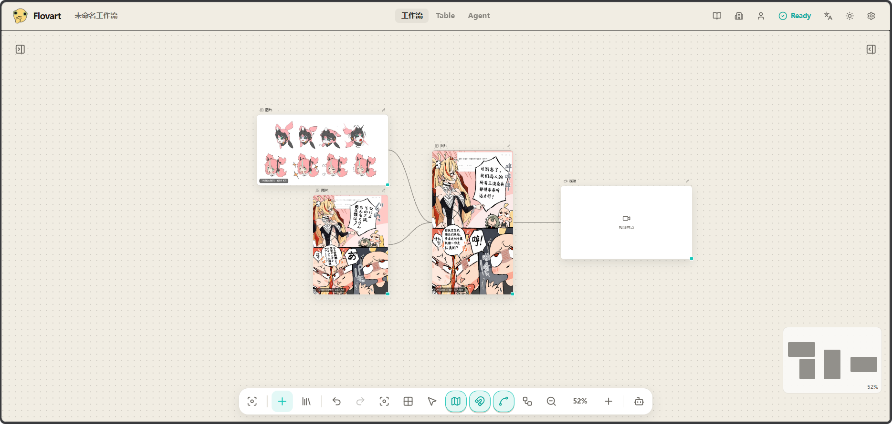
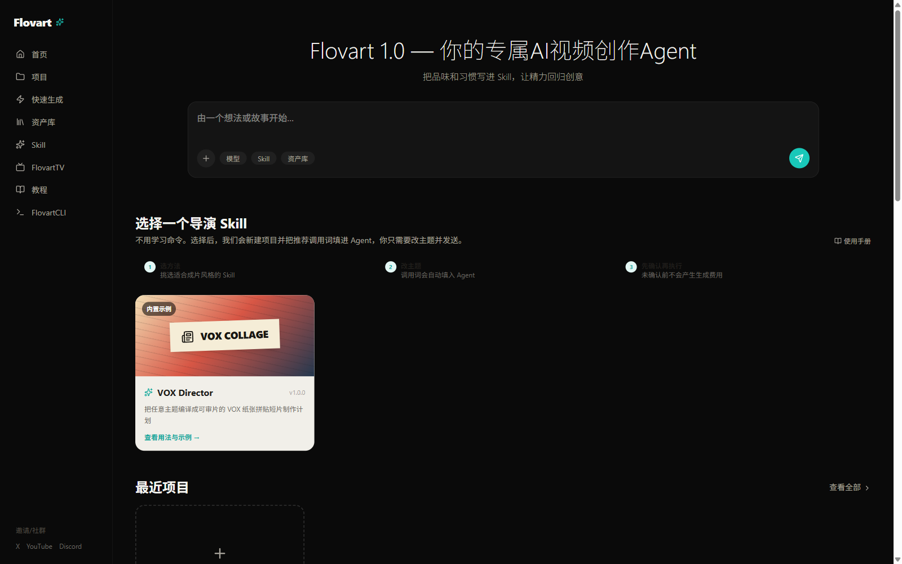
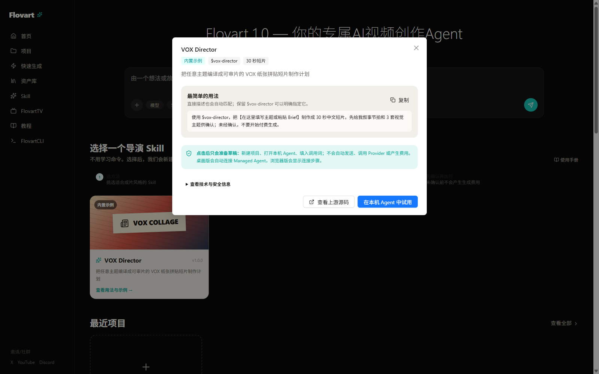
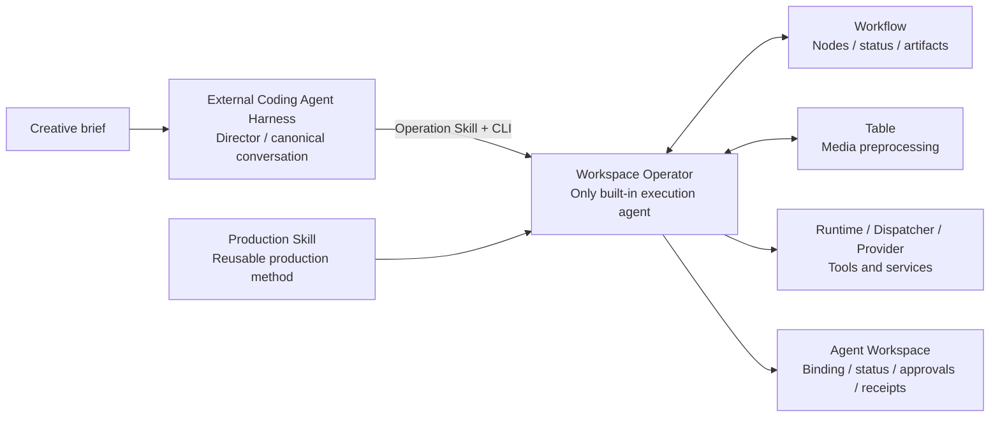

<p align="center">
  
</p>

<h1 align="center">Flovart</h1>

<p align="center">
  <strong>A local-first AI video production system with Workflow, Table, and Agent: orchestration, focused preprocessing, and spatial agent collaboration each have a clear home.</strong>
</p>

<p align="center">
  <a href="https://avabbbb.github.io/Flovart/"><strong>Live Demo</strong></a> ·
  <a href="docs/overview/quick-start.en.md">Getting Started</a> ·
  <a href="docs/content/docs/overview/features.en.mdx">Features</a> ·
  <a href="docs/content/docs/progress/todo.mdx">Roadmap</a> ·
  <a href="stats/README.md">Project Data</a> ·
  <a href=".github/CONTRIBUTING.md">Contributing</a> ·
  <a href="./README.md">简体中文</a>
</p>

<p align="center">
  
  
  
  
  <a href="https://github.com/avabbbb/Flovart/releases"></a>
  <a href="https://github.com/avabbbb/Flovart/stargazers"></a>
</p>

<p align="center">
  <a href="stats/README.md"></a>
  <br />
  <sub>README impressions (third-party counter, not unique visitors)</sub>
</p>

## Interface tour

<p align="center">
  
  <br />
  <sub>Workflow: organize assets, generation nodes, connections, and results in one production graph.</sub>
</p>

<table>
  <tr>
    <td width="50%" align="center">
      
      <br />
      <sub>Skill home: choose a production method before entering a project.</sub>
    </td>
    <td width="50%" align="center">
      
      <br />
      <sub>Low-friction guidance for invocation, cost boundaries, and safety.</sub>
    </td>
  </tr>
</table>

## What is Flovart?

Flovart is a local-first AI video production system with exactly two AI roles: the user's external **Coding Agent Harness** is the director, and Flovart's single lightweight **Workspace Operator** is the built-in execution agent. `Production Crew` is only a group name for the Operator and deterministic tools/services such as dispatchers and runtime workers; it is not a third agent.

**Workflow** owns multi-node generation orchestration, **Table** focuses media preprocessing, and **Agent** is the spatial production control surface. They share providers, assets, and artifact semantics without restoring the removed Canvas or Art system.

| Name | Nature | Responsibility |
| --- | --- | --- |
| **External Coding Agent Harness** | External AI role | The director: owns the canonical conversation, overall goal, long-range plan, cross-task scheduling, and final recommendations. |
| **Workspace Operator** | Only built-in AI role | The execution agent: inspects local state, selects typed tools, and returns a receipt inside one bounded intent. |
| **Production Crew** | Execution group, not an agent | Collective name for the Operator, dispatcher, runtime workers, and workspace tools. |
| **Production Skill** | Production method, not an agent | Defines style, shot language, stages, checkpoints, and acceptance criteria. |
| **Runtime / CLI / Provider Adapter** | Deterministic tools and services | Execute registered capabilities, persist tasks and artifacts, protect credentials, and manage provider lifecycles. |

In one line: **the external harness directs, one built-in Operator executes, and everything else is a tool or service.**



## Why this architecture?

- **Exactly two AI roles**: the external harness owns the overall plan while the internal Operator micro-plans only inside one intent; crew services, workers, and review tools add no agent personas.
- **Separated responsibilities**: Workflow owns multi-node orchestration, Table processes media, and Agent shows the production floor without folding the canonical conversation into the same surface.
- **BYOK and multi-model**: users configure their own credentials while provider adapters connect image, video, and text models.
- **Recoverable production**: the CLI returns JSON status so an agent can poll, retry, and resume instead of relying on one long conversation.
- **Reusable style**: a Production Skill captures production knowledge so the same visual language and process can be applied across projects.
- **Composable capabilities**: writing, storyboarding, visual generation, voice, editing, and quality control use typed tools; optional model-based review remains a one-shot Review Tool.

## Production Skill ecosystem

Flovart will define the minimum integration contract for Production Skills and provide Skill Creator guidance for community authors. The contract covers:

- identity, versioning, compatibility, and required Flovart capabilities;
- brief inputs, configurable parameters, and structured outputs;
- Workflow recipes, production stages, and role ownership;
- style bible, shot rules, sound rules, and forbidden patterns;
- checkpoints, recovery, human approval, and final acceptance;
- artifact lineage, model policy, cost controls, and safety boundaries.

[VOX Skill](https://github.com/avabbbb/vox-director) is the first stylized Production Skill reference; its upstream repository and technical invocation handle remain `vox-director`. The goal is to combine an external director harness, Flovart's Production Crew, Production Skills, and the user's providers into a reusable end-to-end film workflow.

> The currently verified external-director paths are Codex CLI/Browser plus Claude Code and OpenCode CLI tracers; they share the same Operation Skill + local CLI baseline, and Flovart exposes no MCP server. DeepSeek Harness remains an explicit Plugin/Profile projection, while CodeBuddy Code and Pi are compatible targets through the stable Skill + CLI contract. WorkBuddy is a mainstream office AI workspace, not CodeBuddy Code, and is outside the current Director Binding. Logged-in, plugin-lifecycle, and release-state acceptance remain in progress.

## Current capabilities and boundaries

| Module | Status |
| --- | --- |
| Workflow node orchestration, local projects, and assets | Foundation available |
| Table workspace entry point | Integrated; currently a placeholder |
| Table single-media / node preprocessing | In design and implementation |
| Agent spatial task workspace | Older built-in-main-agent UI integrated; migration to the crew control surface is in progress |
| Multi-provider BYOK, text-to-image, image-to-image, and text-to-video | Foundation available |
| Workflow CLI, command schemas, and JSON status | Converging |
| Codex / DeepSeek Harness / Claude Code / OpenCode / Pi | Codex CLI/Browser and Claude Code/OpenCode CLI tracers are verified; DSH is an explicit Plugin projection; CodeBuddy Code/Pi remain compatibility targets pending logged-in and release-state acceptance |
| Production Skill contract and UGC ecosystem | In design and implementation |
| TUI `/xxxx` shortcuts, job subscriptions, and resumable runs | Planned |

The creator runtime is primarily TypeScript and Node.js. Go + Gin + GORM belong to the enterprise control plane for organizations, RBAC, audit, and private deployment management; Go is not the creative runtime. Evidence levels for Hosts, Providers, and plugins are tracked in the [Support Matrix](SUPPORT_MATRIX.md).

## Quick start

### Coding Agent / CLI

```bash
npx flovart-cli install
npx flovart-cli init --target codex
npx flovart-cli start --open
```

`install` downloads and verifies the versioned Runtime + Agent Toolkit. `init --target codex` installs the Flovart Skill and automatic-open entry under `.agents/skills/`; startup prepares the visible Workflow without asking the user to copy a URL, token, or port. Use the matching target for Claude Code or OpenCode. Flovart exposes no MCP server to coding agents; they operate through the local CLI.

### Start the frontend

```bash
git clone https://github.com/avabbbb/Flovart.git
cd Flovart
npm install
npm run dev
```

Open <http://localhost:37522> and configure your own model-service credentials in Settings.

### Inspect the Workflow CLI

```bash
npm run flovart:cli -- status --json
npm run flovart:cli -- start --open --json  # only when status is not ready
npm run flovart:cli -- workflow.inspect --json
```

For compatibility or contract debugging, inspect the machine registry:

```bash
npm run flovart:cli -- command.list --json
npm run flovart:cli -- command.schema --command workflow.inspect --json
npm run flovart:cli -- workflow.project.list --json
```

The CLI accepts explicit commands only. The normal external-agent path is `status`, `start --open` when needed, then `workflow.inspect`; `command.list` and `command.schema` are for bootstrap, compatibility diagnosis, and debugging. External agents should not invent internal HTTP calls or scrape the UI.

Coding Agent projections carry their own Agent Identity on Workflow commands (for example, Codex uses `--agent-identity codex`). The first tagged inspect claims the Host writer; switching Hosts must be explicit in Flovart's Host Picker.

More documentation:

- [Getting Started](docs/overview/quick-start.en.md)
- [Features](docs/content/docs/overview/features.en.mdx)
- [Roadmap](docs/content/docs/progress/todo.mdx)
- [Agent architecture: external director and internal production crew](docs/design/agent/README.md)
- [AI documentation index](docs/index.md)

## Local-first and security

- Projects, assets, and generation history are currently stored primarily in the browser; cloud sync is not promised.
- API keys are currently stored locally in the browser, and the frontend calls configured model services directly.
- Never put API keys in a Production Skill, prompt, log, or repository. Agents and the CLI should only receive redacted readiness status.
- Do not enter API keys into unofficial deployments. Official channels are this repository, the [live demo](https://avabbbb.github.io/Flovart/), and desktop builds published by this repository's Actions.

## Contributing

Issues and pull requests for provider adapters, Workflow capabilities, host integrations, and Production Skills are welcome. Start from the [Issue chooser](https://github.com/avabbbb/Flovart/issues/new/choose) and read the [contribution conventions](.github/CONTRIBUTING.md): keep one problem per Issue, link every PR to an Issue, state non-goals, and attach verification evidence. UI changes require before-and-after screenshots.

Special thanks to [@labiaaaaaaaaa](https://github.com/labiaaaaaaaaa) for driving third-party service compatibility and aggregation-endpoint fixes.

## License and disclaimer

Flovart is licensed under the [GNU Affero General Public License v3.0 only](./LICENSE). By using the project, you agree to the [Terms of Service](./docs/TERMS_OF_SERVICE.md) and [Privacy Policy](./docs/PRIVACY_POLICY.md).

Flovart does not bundle model services and makes no intellectual-property claim over generated content. You are responsible for the copyright, compliance, and lawful use of your models, input assets, and generated output.
