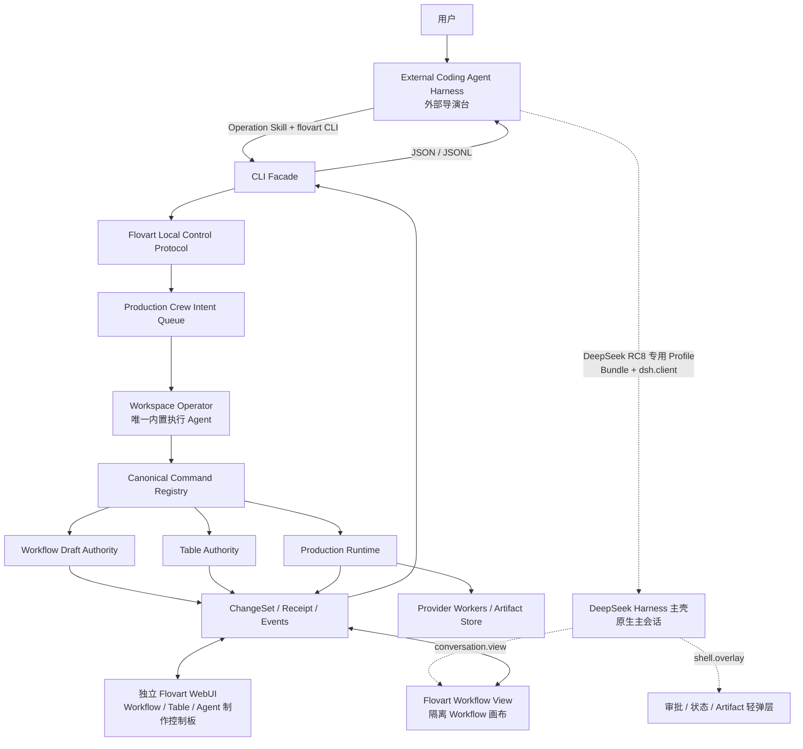

# Agent 架构总览

> 状态：目标设计。当前代码差距见[迁移与验收](10-migration-and-acceptance.md)。

## 一句话定义

系统只有两个 AI 角色：外部 Coding Agent Harness 是导演台，拥有主会话、总体目标与跨任务调度；Flovart Workspace Operator 是唯一内置执行 Agent，只在一个有界意图内调用类型化工具。Production Crew 是 Operator 与确定性执行组件的集合名，不是额外 Agent。

## 系统形状

这里只有两个 AI 角色，而且权力不平级。导演台决定“做什么、先做什么、何时停、接受什么结果”；Workspace Operator 只决定“在当前这一个有界意图内，按什么顺序调用 Flovart 已登记工具”。图中的 Queue、Registry、Runtime 和 Worker 都不是 Agent。

## 四层边界

| 层 | 性质 | 核心职责 | 不能成为 |
| --- | --- | --- | --- |
| External Coding Agent Harness | 外部 AI 角色 | 主对话、目标拆解、长程计划、跨任务调度、最终建议 | Flovart 数据权威、Provider Secret Store |
| Workspace Operator | 唯一内置 AI 角色 | 接收有界意图、读取现场、受限微规划、选择类型化工具、返回回执 | 第二个导演台、长期主会话 |
| Workspace / Production Runtime | 确定性服务 | Schema、状态机、幂等、审批、任务与 Artifact 权威 | Agent、自由文本规划器、宿主会话镜像 |
| Dispatcher / Provider Worker / Review Tool | 工具或服务 | 命令路由、提交、轮询、验证和结构化评审 | Agent、制作计划或用户授权来源 |

## 主流程

1. 用户在 Codex、DeepSeek Harness、Claude Code、OpenCode、Pi 或其它兼容 Coding Agent Projection 中描述目标；Codex 是当前 professional golden path，DSH 保留显式 native Plugin 边界。
2. Harness 读取 Flovart Operation Skill，通过 stable CLI surface 检查工作区、Runtime 与 Provider 状态；`command.list` / `command.schema` 只在 bootstrap/discovery/debug 使用。DeepSeek RC8 专用 Profile 的 Node/Cordis 插件可以将这些能力投影为渐进式工具，Client Plugin 只向 `conversation.view` 追加一个隔离 Workflow 画布，并可向 `shell.overlay` 追加状态/审批/Artifact 轻弹层。
3. Harness 可以直接调用精确原子命令，也可以提交一个有边界的 Crew Intent，例如“把所选三张图排成分支并建立对应生成 Operation”。
4. Workspace Operator 只在该 Intent 范围内读取现场、选择少量类型化命令并执行；每个动作进入同一个 ChangeSet。
5. Runtime Worker 承接长时或 Provider 任务，Operator 不持续轮询。
6. Flovart 返回 Receipt、等待项、Task/Run 句柄和 Artifact 引用；Harness 据此继续导演决策。
7. 付费、发布、覆盖外部目标和不可恢复操作始终停在 Flovart 的明确用户 Gate。

## 当前实现与目标

| 主题 | 当前实现 | 目标 |
| --- | --- | --- |
| 默认主 Agent | `FlovartAgentPanel` 旧内置主 Agent（实现使用 `pi-agent-core`） | 外部 Harness；Flovart 不复制主聊天 |
| Codex | Agent Workspace 中的“子任务” | 与其他 Harness 一样，是独立导演宿主之一 |
| 内置会话 | Node SQLite 或浏览器 localforage 的长期主对话 | 单个 Crew Intent 内的临时微规划上下文 |
| 外部接口 | CLI 与各 Host Projection 的可选会话/事件适配 | 模型工具统一使用 Operation Skill + CLI；DeepSeek 主壳可选单一 Flovart Workflow View 与宿主私有 UI/事件通道 |
| 内部传输 | 多组私有 HTTP/SSE Route | 一个版本化 Local Control Protocol |
| Agent Workspace | 内置主聊天 + Codex 子页签 | Director Binding、Intent、Crew 状态、审批和产物控制板 |

## 不可破坏的约束

- 外部 Harness 进程独立存在；关闭 Flovart WebUI 或 Desktop 不主动终止它。
- Flovart 不保存外部 Harness 的完整聊天、隐藏推理或模型凭据。
- Workspace Operator 没有 Shell、任意文件、任意网络和 Provider Secret。
- 外部 Harness 的模型工具不绕过 CLI 拼接 Flovart 私有 HTTP 请求；DeepSeek Client Plugin 只能使用短期配对、限权的 UI/事件协议客户端。
- 同一项目只有一个 Workflow Draft Authority；同一 ProductionRun 只有一个 Runtime 权威。
- CLI、WebUI 与 Operator 使用同一 Canonical Command Registry，不维护三套工具名单。
- “制作组”只是执行平面集合名，不增加 Agent 数量，也不能动态繁殖或重新制定目标。

## 明确非目标

- 不把 Flovart 变成 Codex、DeepSeek Harness、Claude Code、OpenCode 或 Pi 的聊天壳。
- 不把 DeepSeek Harness 反向嵌入 Flovart Agent 页面，也不让 Flovart 接管 Harness 的主壳、主会话或权限系统。
- 不在 DeepSeek 插件里再造 Flovart 左栏或嵌入 Table、Agent Production Control、Agent Bridge；这些完整产品面只保留在独立 Flovart。
- 不把某个宿主的实验性 app-server/SDK 协议写成 Flovart 核心协议。
- 不复制 DeepSeek Harness 的完整插件内核或“everything is a plugin”实现。
- 不让 Production Skill、Operation Skill、Toolkit Plugin 混成一种可执行扩展。
- 不在文档迁移完成时宣称代码迁移也已经完成。
